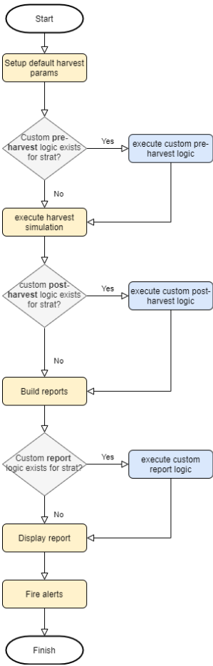

## Overview
Yearn-Simulator is a monitoring tool designed to simulate on-chain actions (e.g. strategy harvests) on forked mainnet and produce a report back to the user via Telegram.

By default, the tool pulls current on-chain data before performing a simulated harvest, and then runs a basic set of checks against the post-harvest state.

Strategists are able to submit individual "plugins" for specific strategies to build upon the default set of data, checks, and alerts. A plugin is simply a python file which implements 3  functions which allow a strategist to inject arbitrary data and logic to the simulation flow.

Simulations happen automatically on a recurring schedule, but can also be produced on demand by talking with the Telegram bot in the "YFI Harvest Simulator" group.

## Usage for Users
Users can consume reports one of two ways:
1. Can subscribe to alert channels in Telegram (one for each log level) 
1. Can join YFI Harvest Simulator Telegram group and talk to the bot
    - To get the bot's attention, simply type `/sim` followed by a strategy or vault address
    - If a strategy address is sent, it will simulate that specific strategy only
    - If a vault address is sent, it will simulate for each active strategy attached to the vault

## Usage for Strategists
When desired, strategists can add a custom plugin for their strategy that will have ability to customize the outputs and alerts for the strategy's report.

The diagram below describes the flow of the simulator process when executing against any individual strategy. To complete a plugin, all that is needed is to implement 3 simple functions whichs map to the blue boxes on the right.

If you are a strategist, you can simply create a file in the `./plugins` directory matching the format `s_[strategy address].py`. From there, you'll need to implement the 3 functions (see example in `./plugins/template.py`) with whatever logic you'd like to perform at the respective steps.

You'll have a lot of power here to inject data or alerts. Reference the data model below to see what data you'll have access to and where to find it.

## Data Model
### Default Generated
`data`  : Object where all data is stored  
`data.pre`: Object where all pre-harvest data is kept  
`data.post`: Object where all the post-harvest data is kept   
`data.report`: Array of name value pairs which is ultimately responsible for triggering alerts and will be displayed in the alerts section of output  
`data.alerts`: Pass in an array of name value pairs + a log level which is ultimately responsible for triggering alerts and will be displayed in the alerts section of output 

### Custom Generated
`data.pre.custom`: Any data in this namespace is available for you to use how you wish
`data.post.custom`: Any data in this namespace is available for you to use how you wish  
`data.custom_report`: This is where you pass an array of "name/value" pair objects which will get posted  
`data.custom_alerts`: This is wehere you pass in an array of name value pairs + log level which is ultimately responsible for triggering alerts and will be displayed in the alerts section of output 