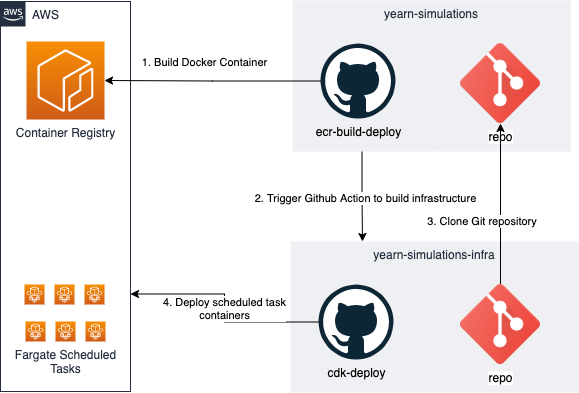

## Overview
Yearn-Simulator is a monitoring tool designed to simulate on-chain actions (e.g. strategy harvests) on forked mainnet and produce a report back to the user via Telegram.

By default, the tool pulls current on-chain data before performing a simulated harvest, and then runs a basic set of checks against the post-harvest state.

Strategists are able to submit individual "plugins" for specific strategies to build upon the default set of data, checks, and alerts. A plugin is simply a python file which implements 3  functions which allow a strategist to inject arbitrary data and logic to the simulation flow.

Simulations happen automatically on a recurring schedule, but can also be produced on demand by talking with the Telegram bot in the "YFI Harvest Simulator" group.

## Install
### With Telegram integration
### Without Telegram integration

## Usage for Users
Users can consume reports one of two ways:
1. Can subscribe to alert channels in Telegram (one for each log level) 
1. Can join YFI Harvest Simulator Telegram group and talk to the bot
    - To get the bot's attention, simply type `/sim` followed by a strategy or vault address
    - If a strategy address is sent, it will simulate that specific strategy only
    - If a vault address is sent, it will simulate for each active strategy attached to the vault

## Usage for Strategists
When desired, strategists can add a custom plugin for their strategy that will have ability to customize the outputs and alerts for the strategy's report.

The diagram below describes the flow of the simulator process when executing against any individual strategy. To complete a plugin, all that is needed is to implement 3 simple functions whichs map to the blue boxes on the right.


If you are a strategist, you can simply create a file in the `./plugins` directory matching the format `s_[strategy address].py`. From there, you'll need to implement the 3 functions (see example in `./plugins/template.py`) with whatever logic you'd like to perform at the respective steps.

You'll have a lot of power here to inject data or alerts. Reference the data model below to see what data you'll have access to and where to find it.


## Data Model
### Default Generated
`data`  : Object where all data is stored  
`data.pre`: Object where all pre-harvest data is kept  
`data.post`: Object where all the post-harvest data is kept   
`data.report`: Array of name value pairs which is ultimately responsible for triggering alerts and will be displayed in the alerts section of output  
`data.alerts`: Pass in an array of name value pairs + a log level which is ultimately responsible for triggering alerts and will be displayed in the alerts section of output 

### Custom Generated
`data.pre.custom`: Any data in this namespace is available for you to use how you wish
`data.post.custom`: Any data in this namespace is available for you to use how you wish  
`data.custom_report`: This is where you pass an array of "name/value" pair objects which will get posted  
`data.custom_alerts`: This is where you pass in an array of name value pairs + log level which is ultimately responsible for triggering alerts and will be displayed in the alerts section of output

## GitHub Actions

To configure GitHub Actions, you need to create an environment named `production` [here](https://github.com/yearn/yearn-simulations/settings/environments) and add the following secrets:

1. `AWS_ACCESS_KEY_ID`
2. `AWS_SECRET_ACCESS_KEY`
3. `YEARN_SIMULATIONS_INFRA_GITHUB_TOKEN` - A GitHub token with permissions to trigger workflows in the https://github.com/numan/yearn-simulations-infra repository


# Creating a New Scheduled Bot

To create a new [brownie script](https://eth-brownie.readthedocs.io/en/stable/interaction.html#writing-scripts), that can output reports to telegram, use the following conventions:

1. Use the environment variable `TELEGRAM_BOT_KEY` as credentials for your telegram bot
2. Use the environment variable `TELEGRAM_CHAT_ID` as the Telegram chat channel to post output to
3. In production, there is an environment variable made available name `ENV`. If the value of `ENV` is `PROD`, then you are running in production. You want want to use this for different behavior in production vs development.

Brownie scripts that follow this convention with automatically be deployed once merged. The environment variables mentioned above will automatically be available to the brownie script in production.

## `@schedule_script` Decorator

Any brownie script decorated with the  `@schedule_script` decorator will automatically be deployed to a production environment and run on the specified schedule.

| Argument  | Description | Example |
| ---- | ---- | ---- |
| **telegram_chat_id**  | The telegram channel you want to output of this script to go to  | `@schedule_script("-1001577510189")` |
| **environment**  | Additional environment variables you want to include when running the scheduled script in production. All values provided must be strings. | `@schedule_script("@yfitestchannel", environment={"USE_DYNAMIC_LOOKUP": "False"})` |
| **secrets**  | Names of additional secrets you want to include in production. **WARNING:** Never include values for any secrets in this repository. Secrets must be provided to an AWS Admin and stored in the Secrets vault before they become available to brownie script in production. | `@schedule_script("@yfitestchannel", secrets=['GITHUB_TOKEN_ID'])` |
| **day**, **hour**, **minute**, **month**, **week_day**, **year** (Scheduling)  | How often do you want to run this script in production. See [this documentation](https://docs.aws.amazon.com/AmazonCloudWatch/latest/events/ScheduledEvents.html#CronExpressions) for details on how to define your schedule. All scheduled times are in UTC. | `@schedule_script("@yfitestchannel", minute="0", hour="0,8,16")` # Schedule the script to run every day at 12AM, 8AM and 4PM UTC |

## Examples

```python
# scripts/hello_script.py
import os

import telebot

from brownie import Contract, accounts, interface
from dotenv import load_dotenv
from scheduler import schedule_script

# Load the local .env file, if available. Don't check in your local .env file!
load_dotenv()

TELEGRAM_BOT_KEY = os.getenv("TELEGRAM_BOT_KEY")
TELEGRAM_CHAT_ID = os.getenv("TELEGRAM_CHAT_ID")

ENVIRONMENT = os.getenv("ENV")

# Schedule this script to run every day and every 10 min
# between 12AM-12:59AM UTC, 8AM-8:59AM UTC and 4PM-4:50PM UTC
@schedule_script(
    "@yfitestchannel",
    minute="0/10",
    hour="0,8,16",
    secrets=['GITHUB_KEY'], # Must be configured by an AWS Admin before available in production
    environment={
        "DYNAMIC_LOOKUP": "False" # This will be the value of the environment variable in production
    }
)
def main():
    # You can change this value locally by defining it in your local .env file. 
    # In production, this will always have a value of "False" (as specified by the 
    # `scheduled_script` decorator)
    USE_DYNAMIC_LOOKUP = os.getenv("DYNAMIC_LOOKUP", "True")  

    # You can change this value locally by defining it in your local .env file.
    # In production, you must ask an AWS Admin to store the value of this secret
    # in the Secrets vault before it is available in production.
    GITHUB_KEY = os.getenv("GITHUB_KEY")

    bot = telebot.TeleBot(TELEGRAM_BOT_KEY)
    report = ""

    ## TODO: Do some fancy stuff with contracts

    if ENVIRONMENT == "PROD":
        bot.send_message(TELEGRAM_CHAT_ID, report, parse_mode="markdown", disable_web_page_preview=True)
    else:
        print(report)

```

## Deployment Workflow



Any brownie script decorated with the `@schedule_script` decorator automatically gets deployed as a scheduled task in production when merged into the `master` branch.

1. Builds a docker container and deploys the container to an `Elastic Container Registry`
2. Triggers a GitHub Action in the https://github.com/numan/yearn-simulations-infra repository
3. Clones this repository and builds a `Fargate Scheduled Task` for every brownie script decorated with the `@schedule_script` decorator
4. Builds and updates the production infrastructure